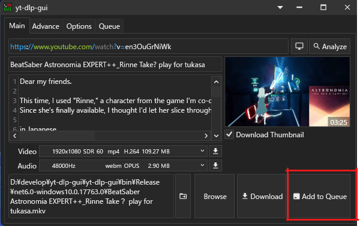
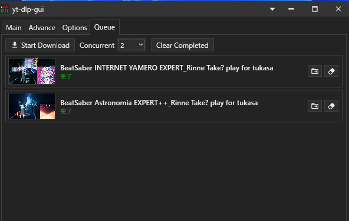
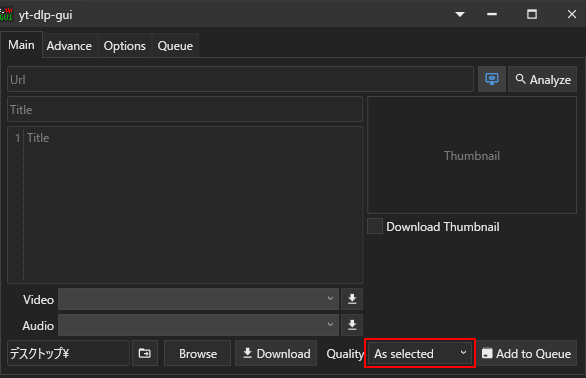
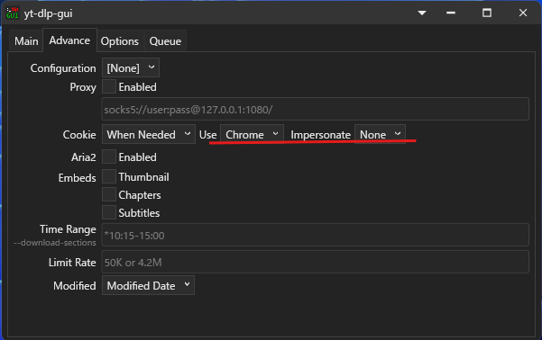

# yt-dlp-gui-custom

Fork of [yt-dlp-gui](https://github.com/kannagi0303/yt-dlp-gui) by かんなぎ (Kannagi)

* Front-end of [yt-dlp](https://github.com/yt-dlp/yt-dlp) (and Compatible Applications)
* Windows Only (10 or above)

---

## English

### Additional Features (Custom)

#### Download Queue

Add multiple videos to queue and download in parallel.

1. Analyze a video URL
2. Click **Add to Queue** button to add to download queue

3. Go to **Queue** tab to manage downloads
4. Set **Concurrent** to control parallel download count (1-10)
5. Click **Start Download** to begin

#### Download Quality for Queued Items

Choose the quality applied when an item is added to the queue, using the **Quality** dropdown next to **Add to Queue**.

| Option | Behaviour |
| --- | --- |
| **As selected** | Uses the format chosen in **Video** / **Audio** on the Main tab (default) |
| **Max (auto)** | Highest quality available for that video |
| **High (1080p)** | Best quality at or below 1080p |
| **Medium (720p)** | Best quality at or below 720p |
| **Low (480p)** | Best quality at or below 480p |
| **Min (auto)** | Lowest quality available for that video |

A format ID is specific to the video it came from, so it cannot be reused across different URLs. *As selected* therefore only works when each URL is analyzed before queueing it. The presets avoid this by resolving the quality per video at download time, which makes them the reliable choice when queueing many URLs at once.

**Fallback:** if a video does not offer the requested resolution, the download falls back to **Max**. *Max* and *Min* are detected per video, so they never fail.

The selection is stored per queue item and remembered between sessions.

#### Temporary Folder

**Options** tab → **Temporary folder** controls where in-progress files (`.part`, stream fragments) are written before being moved to the destination. This matters for HLS/m3u8 downloads, which produce a large number of short-lived fragment files.

| Option | Location |
| --- | --- |
| **Target** | Same folder as the final output |
| **Locale** | `temp` folder next to the executable (default) |
| **System** | The system `%TEMP%` folder |
| **Browse...** | Any folder you choose |

#### Bot Detection Bypass

Use browser impersonation to bypass bot detection (useful for sites like YouTube).

1. Go to **Advance** tab
2. Set **Impersonate** to Chrome, Edge, Firefox, or Safari

### Features (Original)
* Easy-to-use
* Portable
* Selectable video quality
* Download single chapter
* Download single stream
* Cookie supported
* Configuration supported
* External Downloader supported (Aria2)
* Localized Language supported

### Requirements
* All required components (yt-dlp, FFMPEG) are included in the release package

### Credits
* Original Author: [かんなぎ (Kannagi)](https://github.com/kannagi0303)
* Original Repository: [yt-dlp-gui](https://github.com/kannagi0303/yt-dlp-gui)

For original documentation, please refer to the [original wiki](https://github.com/kannagi0303/yt-dlp-gui/wiki).

### Troubleshooting

If you encounter any issues, please include the log file when reporting:

1. Log files are stored in the `logs/` folder (same location as the executable)
2. Log filename format: `yyyy-MM-dd-HHmmss.log` (e.g., `2024-01-15-143052.log`)
3. Logs are automatically rotated after 30 days
4. When creating an issue, attach the relevant log file to help us diagnose the problem

> Logs record the URLs and titles you downloaded. Review a log before attaching it to a public issue.

### Disclaimer
This tool is intended for legal purposes only. MixedNuts assumes no responsibility for any damages or issues arising from the use of this tool.

---

## 日本語

### 追加機能 (カスタム版)

#### ダウンロードキュー

複数の動画をキューに追加して並列ダウンロードできます。

1. 動画URLを分析
2. **Add to Queue** ボタンをクリックしてキューに追加

3. **Queue** タブでダウンロードを管理
4. **Concurrent** で同時ダウンロード数を設定 (1-10)
5. **Start Download** をクリックして開始

#### キュー追加時の画質指定

**Add to Queue** の隣にある **画質** ドロップダウンで、キューに追加する際の画質を指定できます。

| 選択肢 | 動作 |
| --- | --- |
| **選択どおり** | メイン画面の **映像** / **音声** で選択中のフォーマットを使用（既定） |
| **最大 (自動)** | その動画で取得できる最高画質 |
| **高 (1080p)** | 1080p 以下で最良の画質 |
| **中 (720p)** | 720p 以下で最良の画質 |
| **低 (480p)** | 480p 以下で最良の画質 |
| **最小 (自動)** | その動画で取得できる最低画質 |

フォーマットIDは取得元の動画に固有のため、別のURLには流用できません。そのため *選択どおり* は、URLごとに分析してからキューに追加する場合にのみ機能します。プリセットはダウンロード時に動画ごとの画質を解決するのでこの問題を回避でき、複数URLをまとめてキューに積む場合はこちらが確実です。

**フォールバック:** 指定した解像度がその動画に無い場合は **最大** 画質にフォールバックします。*最大* と *最小* は動画ごとに自動取得するため、取得できないことはありません。

選択内容はキューの項目ごとに保存され、再起動後も維持されます。

#### 一時フォルダー

**Options** タブ → **一時フォルダー** で、ダウンロード中のファイル（`.part` やストリームの断片）を書き出す場所を指定できます。短命な断片ファイルが大量に発生する HLS/m3u8 のダウンロードで特に効いてきます。

| 選択肢 | 保存場所 |
| --- | --- |
| **Target** | 最終的な出力先と同じフォルダー |
| **Locale** | 実行ファイルと同じ場所の `temp` フォルダー（既定） |
| **システム** | システムの `%TEMP%` フォルダー |
| **参照** | 任意のフォルダーを指定 |

#### Bot検出回避

ブラウザ偽装でBot検出を回避できます（YouTubeなどで有効）。

1. **Advance** タブを開く
2. **Impersonate** でChrome、Edge、Firefox、Safariのいずれかを選択

### 機能 (オリジナル版)
* シンプルで使いやすい
* ポータブル（インストール不要）
* 動画品質の選択が可能
* 単一チャプターのダウンロード
* 単一ストリームのダウンロード
* Cookie対応
* 設定ファイル対応
* 外部ダウンローダー対応 (Aria2)
* 多言語対応

### 必要なもの
* 必要なコンポーネント (yt-dlp, FFMPEG) はリリースパッケージに同梱されています

### クレジット
* オリジナル作者: [かんなぎ (Kannagi)](https://github.com/kannagi0303)
* オリジナルリポジトリ: [yt-dlp-gui](https://github.com/kannagi0303/yt-dlp-gui)

詳細なドキュメントは[オリジナルのwiki](https://github.com/kannagi0303/yt-dlp-gui/wiki)を参照してください。

### トラブルシューティング

問題が発生した場合は、Issueにログファイルを添付してください:

1. ログファイルは `logs/` フォルダに保存されます（実行ファイルと同じ場所）
2. ログファイル名の形式: `yyyy-MM-dd-HHmmss.log`（例: `2024-01-15-143052.log`）
3. ログは30日後に自動的にローテーションされます
4. Issueを作成する際は、該当するログファイルを添付してください

> ログにはダウンロードしたURLとタイトルが記録されます。公開のIssueに添付する前に内容をご確認ください。

### 免責事項
本ツールは合法的な目的でのみ使用してください。本ツールで生じた損害等に関してMixedNutsでは一切責任を負いません。
